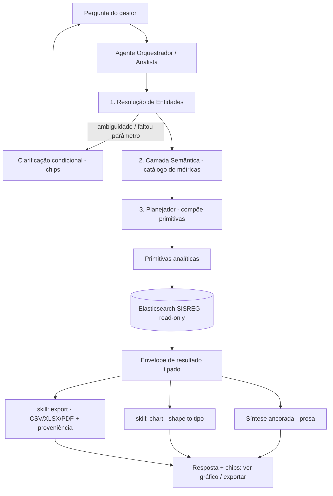

# Spec — Agente Analítico Genérico · Fila Eletiva DF (IGES-DF)

> **Projeto:** Fila Eletiva DF — assistente de regulação assistencial (SISREG-DF)
> **Fonte de dados:** Elasticsearch SISREG (API REST read-only, manual v2.1)
> **Status:** Especificação de evolução — POC
> **Metodologia:** Spec-Driven Development (SDD)
> **Objetivo:** Evoluir o chatbot de *roteador de intenções fechado* (descritivo) para um
> **agente analítico genérico e ancorado** (descritivo → diagnóstico → prescritivo), capaz de
> responder perguntas livres sobre a fila sem playbooks pré-determinados, sugerindo gráficos e
> exportações com proveniência.

---

## 0. Contexto e a virada de arquitetura

### O problema atual
O bot hoje funciona por **roteador de intenções fechado**: reconhece um conjunto fixo
(top CIDs, distribuição por status, agendamentos, cancelamentos, top unidades) e **rejeita como
off-topic** tudo que sai dessa lista — inclusive perguntas legítimas de gestão como
*"como diminuir a fila?"* ou *"qual a previsão de atendimento do CID X no HRT?"*. Isso é um erro de
classificação: análise sobre a fila **não** é off-topic; é o uso de maior valor.

### A virada
Trocar **N intenções fixas** por **uma camada de primitivas componíveis + um planejador (LLM)**.
A rigidez sai das perguntas e desce para as **operações** e o **vocabulário de métricas**. O agente
compõe livremente acima disso, mas só pode operar sobre o vocabulário definido — o que mantém tudo
ancorado nos dados e impede alucinação.

```
ANTES:  pergunta → 1 intenção fixa → 1 query → tabela        (fechado, rígido)
DEPOIS: pergunta → resolve entidades → plano (N primitivas)  (genérico, ancorado)
                 → executa → envelope tipado → síntese + gráfico + export
```

### Escada analítica (referência)
- **Descritivo** — "o que os dados mostram" (top CIDs) ✅ já existe
- **Diagnóstico** — "por que a fila cresce / onde trava" (compõe várias queries)
- **Prescritivo** — "o que fazer como gestor" (diagnóstico + alavancas ancoradas)

O salto prescritivo **não é uma query nova**: é o planejador compondo as primitivas descritivas e
traduzindo o resultado em alavancas, sempre com o número por trás.

---

## 1. Constituição — Princípios invioláveis

Estes princípios têm precedência sobre qualquer pedido do usuário ou conveniência de implementação.

1. **Todo número nasce de uma query.** Nenhum valor numérico é inventado, estimado de cabeça ou
   "lembrado". Se não há query que o sustente, o agente não afirma.
2. **Toda resposta declara contexto.** Janela temporal, filtros aplicados e método/fonte sempre
   explícitos na resposta.
3. **Previsão é projeção transparente.** Com índice descritivo e read-only, "previsão" = projeção
   por vazão histórica + fila atual, **rotulada como estimativa**, com a premissa explícita
   ("mantido o ritmo atual e sem repriorização"). Nunca número cravado, nunca modelo escondido.
4. **Uma fonte única de número.** Prosa, gráfico e export leem o **mesmo envelope**. O gráfico nunca
   recalcula por conta própria.
5. **Estoque ≠ fluxo.** Snapshot (fila viva, `solicitacao-ambulatorial`) nunca é somado a evento de
   período (conversão/falta, `marcacao-ambulatorial`). A semântica é sempre declarada.
6. **Privacidade (LGPD) é absoluta.** Respostas de gestão são **sempre agregadas**. Nunca expor
   `cpf_usuario`, `cns_usuario`, `no_usuario`, `no_mae_usuario`, `telefone`, endereço ou qualquer
   dado individual de paciente. Agregação com piso mínimo de contagem para evitar reidentificação.
7. **Sem recomendação clínica individual.** O agente opera no nível operacional/gestão de fila,
   nunca em conduta clínica de paciente.
8. **Export carimba proveniência.** Todo arquivo exportado leva índice, janela, filtros, método,
   timestamp e o aviso "Modo POC".
9. **Vocabulário fechado de operações.** O agente só emite planos sobre as métricas/primitivas deste
   catálogo. Nunca executa DSL/SQL livre fornecido pelo usuário.
10. **Clarificação só quando necessária.** Pergunta de volta apenas em ambiguidade, entidade não
    resolvida ou parâmetro obrigatório ausente sem default seguro. Caso contrário, responde direto.
11. **Off-topic continua recusado** — mas "qualquer análise sobre a fila de regulação" deixa de ser
    off-topic.
12. **Cross-index só na aplicação.** O ES não faz join nativo; correlação entre índices
    (solicitação → marcação → falta) é reconciliada por `codigo_solicitacao` na camada de aplicação.

---

## 2. Arquitetura



**Componentes:**
- **Orquestrador (único agente que raciocina):** resolve entidade, escolhe métrica, monta plano,
  executa, sintetiza, decide quando perguntar de volta.
- **Skills determinísticas (não são agentes):** `chart` (mapa `shape → tipo`) e `export`
  (serialização pura). Critério: *agente = decisão aberta; skill = transformação determinística.*
  Gráfico e export não raciocinam, logo não são agentes — viram skills chamadas pelo orquestrador.

---

## 3. Camada de Resolução de Entidades

Onde o agente genérico quebra calado se for descuidado. Precisa de **dicionário de apelidos**.

### 3.1 Unidades (seed — completar/validar via CNES)
Mapeia o texto livre do usuário para `nome_unidade_executante` / `codigo_unidade_executante` (CNES).
**Não preencher CNES com valor inventado** — deixar placeholder até validação.

| Apelido | Nome oficial (match em `nome_unidade_*`) | CNES |
|---|---|---|
| HBDF, HB, Base | Hospital de Base do Distrito Federal | `<preencher>` |
| HRAN | Hospital Regional da Asa Norte | `<preencher>` |
| HRT | Hospital Regional de Taguatinga | `<preencher>` |
| HRC | Hospital Regional de Ceilândia | `<preencher>` |
| HRG | Hospital Regional do Gama | `<preencher>` |
| HRGu | Hospital Regional do Guará | `<preencher>` |
| HRSam | Hospital Regional de Samambaia | `<preencher>` |
| HRSM | Hospital Regional de Santa Maria | `<preencher>` |
| HRPl | Hospital Regional de Planaltina | `<preencher>` |
| HRPa | Hospital Regional do Paranoá | `<preencher>` |
| HRSob | Hospital Regional de Sobradinho | `<preencher>` |
| HRBz | Hospital Regional de Brazlândia | `<preencher>` |
| HUB | Hospital Universitário de Brasília | `<preencher>` |
| HMIB | Hospital Materno Infantil de Brasília | `<preencher>` |

> Estratégia de match: alias exato → senão fuzzy/`match` em `nome_unidade_executante`. Match
> ambíguo (≥2 candidatos) **dispara clarificação**.

### 3.2 Prioridade (`codigo_classificacao_risco`)
| Texto do usuário | Código |
|---|---|
| emergência, P0 | `1` |
| urgência, P1 | `2` |
| não urgente, P2 | `3` |
| eletivo, P3 | `4` |

### 3.3 CID
`codigo_cid_solicitado` / `codigo_cid_agendado`. Aceitar código direto (`X00`/`X000`). Para nome em
linguagem natural ("diabetes", "catarata"), resolver contra uma **tabela de referência CID-10**
(não hardcodar mapeamentos). Código que não bate → clarificação.

### 3.4 Grupos de status (ambulatorial)
| Grupo lógico | `status_solicitacao` incluídos |
|---|---|
| **fila / pendente** | `SOLICITAÇÃO / PENDENTE / FILA DE ESPERA`, `SOLICITAÇÃO / PENDENTE / REGULADOR`, `SOLICITAÇÃO / REENVIADA / REGULADOR` |
| **agendado** | `SOLICITAÇÃO / AGENDADA / SOLICITANTE`, `SOLICITAÇÃO / AGENDADA / COORDENADOR`, `SOLICITAÇÃO / AGENDADA / FILA DE ESPERA`, `SOLICITAÇÃO / AUTORIZADA / REGULADOR`, `AGENDAMENTO / PENDENTE CONFIRMAÇÃO / EXECUTANTE` |
| **atendido / confirmado** | `AGENDAMENTO / CONFIRMADO / EXECUTANTE` |
| **falta** | `AGENDAMENTO / FALTA / EXECUTANTE` |
| **cancelado / negado / devolvido** | `SOLICITAÇÃO / CANCELADA / *`, `AGENDAMENTO / CANCELADO / *`, `SOLICITAÇÃO / NEGADA / REGULADOR`, `SOLICITAÇÃO / DEVOLVIDA / REGULADOR` |

---

## 4. Camada Semântica — Catálogo de Métricas

O **ativo reutilizável central**. Define uma vez; o agente responde infinitas perguntas combinando
métrica × dimensão × filtro. Cada métrica aponta para campo/índice reais do manual v2.1.

| # | Métrica | Definição de negócio | Índice | Fórmula / campos | Unidade | Obs. |
|---|---|---|---|---|---|---|
| 1 | `estoque_fila` | Fila viva no momento | `solicitacao-ambulatorial` | count(status ∈ **fila/pendente**) | docs | **snapshot** |
| 2 | `entrada_solicitacoes` | Inflow (novas solicitações) | `solicitacao-ambulatorial` | count por `data_solicitacao` no período | docs | fluxo |
| 3 | `agendamentos` | Marcações realizadas | `marcacao-ambulatorial` | count por `data_marcacao`/`data_aprovacao` | docs | fluxo |
| 4 | `atendimentos` | Outflow (vazão) | `marcacao-ambulatorial` | count(`marcacao_executada=1` ou status **confirmado**) por `data_confirmacao` | docs | fluxo |
| 5 | `faltas` | No-show | `marcacao-ambulatorial` | count(`st_falta_registrada=1`) | docs | fluxo |
| 6 | `cancelamentos` | Cancelados/negados/devolvidos | `marcacao-ambulatorial` / `solicitacao-ambulatorial` | count(status **cancelado**) por `data_cancelamento` | docs | fluxo |
| 7 | `taxa_falta` | % de falta | `marcacao-ambulatorial` | `faltas / agendamentos` | % | derivada |
| 8 | `taxa_conversao` | % que vira atendimento | `marcacao-ambulatorial` | `atendimentos / agendamentos` | % | derivada |
| 9 | `taxa_cancelamento` | % cancelado | `marcacao-ambulatorial` | `cancelamentos / agendamentos` | % | derivada |
| 10 | `tempo_espera_total` | Espera ponta a ponta | `marcacao-ambulatorial` | `lead_time(data_solicitacao → data_confirmacao)` | dias | mediana/p90 |
| 11 | `tempo_regulacao` | Espera na regulação | `marcacao-ambulatorial` | `lead_time(data_solicitacao → data_aprovacao)` | dias | segmento |
| 12 | `tempo_marcacao` | Aprovação → marcação | `marcacao-ambulatorial` | `lead_time(data_aprovacao → data_marcacao)` | dias | segmento |
| 13 | `tempo_execucao` | Marcação → atendimento | `marcacao-ambulatorial` | `lead_time(data_marcacao → data_confirmacao)` | dias | segmento |
| 14 | `efeito_aviso` | Falta vs. paciente avisado | `marcacao-ambulatorial` | `taxa_falta` segmentada por `st_paciente_avisado` (0/1) | % | **diagnóstico de alavanca** |
| 15 | `previsao_atendimento` | Estimativa de espera | ambos | `estoque_fila(filtro) ÷ vazão_média_diária(filtro)` | dias | **projeção — `method_note` obrigatória** |
| 16 | `mix_tipo_vaga` | Primeira vez vs retorno | ambos | breakdown por `codigo_tipo_vaga_solicitada` (1/2) | docs | retorno entope fila |
| 17 | `cancel_por_perfil` | Quem cancela | ambos | breakdown por `nome_perfil_cancelamento` | docs | paciente vs sistema |

> **Por que estas métricas são "ouro":** `st_paciente_avisado × st_falta_registrada` (#14) prova a
> alavanca de confirmação ativa com o número, não com palpite. A cadeia de datas (#10–#13) mostra
> *onde* a fila trava. `nome_perfil_cancelamento` (#17) diz se o cancelamento é do paciente ou do
> sistema — alavanca diferente. O índice já carrega a **causa**; o bot descritivo só mostrava o
> **sintoma** (contagem).

---

## 5. Primitivas Analíticas (assinaturas)

O planejador encadeia estas operações. Toda primitiva recebe `index`, `filters` e `window`.

| Primitiva | Assinatura | Retorna (`shape`) | ES |
|---|---|---|---|
| `count` | `count(index, filters, window)` | `scalar` | count / value_count |
| `breakdown` | `breakdown(index, dimension, metric, filters, window, top_n)` | `breakdown` | terms agg |
| `timeseries` | `timeseries(index, date_field, interval, metric, filters, window)` | `timeseries` | date_histogram |
| `stats` | `stats(index, field, filters, window)` | `distribution` | stats / percentiles |
| `lead_time` | `lead_time(index, start_date, end_date, filters, window)` | `distribution` | script/runtime field + percentiles |
| `compare` | `compare(index, dimension, metric, entity, filters, window)` | `comparison` | terms agg + destaque da entidade |

**Filtros padrão disponíveis:** `cid`, `prioridade`, `unidade_solicitante`, `unidade_executante`,
`grupo_procedimento`, `tipo_regulacao` (R/F), `tipo_vaga`, `status_grupo`, `municipio`, `bairro`.

> Cuidado de implementação: o terms agg traz `doc_count_error_upper_bound` (o "erro máximo de
> contagem" já exibido na POC). Expor esse erro quando relevante e considerar `shard_size` em
> consultas de alta cardinalidade.

---

## 6. Dimensões de breakdown disponíveis

`prioridade` (`codigo_classificacao_risco`) · `cid` (`codigo_cid_*`) · `grupo_procedimento`
(`nome_grupo_procedimento`) · `unidade_solicitante` · `unidade_executante` · `tipo_regulacao`
(R/F) · `tipo_vaga` (1ª vez/retorno) · `perfil_cancelamento` · `municipio`/`bairro` · `tempo`
(date_histogram sobre qualquer campo de data).

---

## 7. Clarificação Condicional (slot-filling adaptativo)

Não é entrevista obrigatória — dispara **somente** quando:
1. **Entidade não resolve** — "XPTO não corresponde a nenhum CID. Quis dizer...?"
2. **Ambiguidade** — "HRT ou HRAN?" / "fila atual (estoque) ou entrada no período (fluxo)?"
3. **Parâmetro obrigatório ausente sem default seguro** — tipicamente a **janela temporal**.

UX: **chips** (2–4 opções + "outro/não sei"), nunca campo de texto longo (usuário no celular).
Máx. 3 perguntas; sempre a de maior ganho de informação primeiro. O usuário pode pular ("só me dá a
resposta") → o agente assume defaults e os **declara**.

**Nunca perguntar o que o índice já responde** (ex.: "quantos estão na fila?"). Dados o agente busca;
ao gestor só pergunta o que o dado não sabe (escopo, objetivo, recurso, janela).

**Defaults seguros:** janela = últimos 30 dias · prioridade = todas · status = grupo coerente com a
métrica (ex.: `taxa_falta` usa universo de agendados).

---

## 8. Contrato de Saída — o Envelope

O orquestrador devolve um **objeto tipado**, não só prosa. É a fonte única de número para prosa,
gráfico e export.

```json
{
  "shape": "scalar | timeseries | breakdown | comparison | distribution",
  "metric": "taxa_falta",
  "dimension": "unidade_executante | null",
  "filters": { "cid": "C50", "unidade_executante": "HRT", "prioridade": "2" },
  "window": { "gte": "2026-04-21", "lte": "2026-05-21", "label": "últimos 30 dias" },
  "data": [ { "key": "...", "value": 0.0, "count": 0 } ],
  "units": "% | dias | documentos",
  "method_note": "string | null",
  "source_index": "solicitacao-ambulatorial-df-brasilia",
  "doc_count_error": 0,
  "generated_at": "2026-05-21T08:26:00-03:00",
  "poc": true
}
```

### 8.1 Mapa `shape → gráfico` (skill `chart`, determinística)
| `shape` | Visual | Regra |
|---|---|---|
| `scalar` | número/card | sem gráfico |
| `timeseries` | linha | eixo X = tempo |
| `breakdown` | barra | **tabela** se cardinalidade > limite (ex.: > 12 categorias) |
| `comparison` | barra | entidade em destaque vs benchmark |
| `distribution` | barra/histograma | exibir mediana e p90 |

Gráfico com `shape ≠ scalar` é **renderizado inline automaticamente** (o dado já é a resposta visual).

### 8.2 Export (skill `export`, função pura)
- **CSV/XLSX:** as linhas de `data[]`.
- **PDF:** cabeçalho de proveniência + gráfico + tabela. Para handoff do gestor.
- **Sempre ação do usuário** (chip [Exportar Excel]/[Exportar PDF]), nunca automático.
- **Carimbo de proveniência obrigatório** (Princípio 8): `source_index`, `window`, `filters`,
  `method_note`, `generated_at`, aviso "Modo POC".

---

## 9. Exemplos ponta a ponta

### Exemplo A — "Top 10 CIDs solicitados nos últimos 30 dias" (descritivo, já existe)
- resolve: nenhuma entidade especial · janela = 30d (default)
- plano: `breakdown(solicitacao-ambulatorial, dimension=cid, metric=estoque_fila, top_n=10)`
- envelope: `shape=breakdown`, `units=documentos` → **barra** + chips de export.

### Exemplo B — "Hoje, qual a previsão de atendimento do CID C50 no HRT?" (prescritivo/projeção)
- resolve: `cid=C50` · `unidade_executante=HRT` (alias → nome/CNES) · janela de vazão = 30d default
- plano (2 primitivas):
  1. `count(solicitacao-ambulatorial, filters={cid:C50, unidade:HRT, status_grupo:fila})` → fila atual
  2. `timeseries(marcacao-ambulatorial, atendimentos, filters={cid:C50, unidade_executante:HRT}, 30d)`
     → vazão média/dia
- métrica: `previsao_atendimento = fila ÷ vazão_média_diária` (refinar por prioridade se pedido)
- envelope: `shape=scalar`, `units=dias`,
  `method_note="estimativa por vazão dos últimos 30 dias e fila atual; mantido o ritmo e sem repriorização"`
- resposta: *"Estimativa de ~X dias..."* — **rotulada como estimativa** (Princípio 3).

### Exemplo C — "Por que tanta gente falta no HRT?" (diagnóstico → alavanca)
- plano: `efeito_aviso` → `breakdown(marcacao-ambulatorial, dimension=st_paciente_avisado, metric=taxa_falta, filters={unidade_executante:HRT})`
- envelope: `shape=comparison`, `units=%`
- síntese: *"A falta é A% quando o paciente não foi avisado vs B% quando foi → alavanca: confirmação
  ativa."* (alavanca ancorada no número, não no palpite).

### Exemplo D — pergunta do print 2, reformulada
- "como diminuir a fila?" **não** é off-topic. Vira diagnóstico composto: `entrada_solicitacoes` ×
  `atendimentos` (cresce ou estabiliza?), `breakdown` por prioridade/CID/unidade, deltas de
  `tempo_*` (onde trava). Se faltar objetivo/recurso → **clarificação por chips**, depois responde
  com alavancas ancoradas.

---

## 10. Tratamento de Off-topic

Mantido, mas redefinido: **off-topic = não tem relação com a fila de regulação SISREG-DF**.
Análise, diagnóstico e recomendação de gestão *sobre a fila* são **on-topic**. A recusa do print 2
("não parece relacionada à fila") era falso-positivo e deve ser corrigida.

---

## 11. Critérios de Validação (VALIDATE)

- [ ] Toda resposta numérica tem query rastreável (zero número inventado).
- [ ] Toda resposta exibe janela + filtros + método.
- [ ] Respostas de `previsao_*` aparecem rotuladas como estimativa, com premissa.
- [ ] Prosa, gráfico e export de uma mesma resposta batem (mesmo envelope).
- [ ] Nenhuma resposta de gestão expõe PII (CPF/CNS/nome/telefone/endereço).
- [ ] Snapshot e fluxo nunca somados; semântica declarada.
- [ ] Export sempre carimba proveniência + POC.
- [ ] Entidade ambígua/não resolvida dispara clarificação (não chuta).
- [ ] "Como diminuir a fila?" e perguntas análogas **não** são recusadas como off-topic.
- [ ] Agente recusa DSL/SQL livre do usuário.

---

## 12. Roadmap / Fora de escopo

- **Fora de escopo agora (descritivo/read-only):** previsão estatística real (sazonalidade,
  tendência). Hoje só projeção transparente por vazão. Forecast de modelo exigiria camada preditiva
  separada — fase futura, e o chat avisa quando a pergunta extrapola o que o dado sustenta.
- **Fase futura — "agente de insight"** (este sim raciocina): narra tendências e prioriza alavancas
  em multipasso. Só aí faz sentido um agente adicional separado do orquestrador.
- **Hospitalar:** estender o catálogo ao índice `solicitacao-hospitalar` (internações) reaproveitando
  primitivas; atenção aos campos próprios (`carater`, `codigo_natureza_lesao`, leitos).

---

## Anexo — Referência rápida (manual SISREG v2.1)

**Índices:** `marcacao-ambulatorial-{uf}-{municipio}` · `solicitacao-ambulatorial-{uf}-{municipio}` ·
`solicitacao-hospitalar-{uf}-{municipio}` (nível federal → sufixo `-nacional`).

**Campos-chave por uso:**
- *Estoque/fila* (`solicitacao-ambulatorial`): `status_solicitacao`, `codigo_classificacao_risco`,
  `codigo_cid_solicitado`, `codigo_grupo_procedimento`, `codigo_unidade_solicitante`,
  `data_solicitacao`, `data_desejada`, `codigo_tipo_regulacao` (R/F), `codigo_tipo_vaga_solicitada`.
- *Conversão/falta/execução* (`marcacao-ambulatorial`): `st_falta_registrada` (0/1),
  `st_paciente_avisado` (0/1), `marcacao_executada` (0/1), `nome_unidade_executante`,
  `data_aprovacao`, `data_marcacao`, `data_confirmacao`, `data_cancelamento`,
  `nome_perfil_cancelamento`, `codigo_solicitacao` (chave de reconciliação cross-index).
- *PII — NUNCA expor:* `cpf_usuario`, `cns_usuario`, `no_usuario`, `no_mae_usuario`, `telefone`,
  campos de endereço.

**Prioridade (`codigo_classificacao_risco`):** 1=Emergência(P0) · 2=Urgência(P1) · 3=Não urgente(P2)
· 4=Eletivo(P3).
